# 식당 번호표 발급 시스템 개발 - Software Design

## Initial Request

- 주제 : 식당 웨이팅 관리 프로그램
- 목적 
  - 특정 시간(점심시간 등)이나, 인기 있는 식당에 방문 할 때에는 테이블이 가득 차서 식당 밖에서 줄을 서야하는 경우가 많습니다. 번호표를 나누어 주거나 하는 경우도 있지만 내 번호 앞에 몇 명이 남았는지 알 수 없어 식당 앞에서 대기를 해야하고, 자리가 나지 않았음에도 식당에 꼭 방문해서 번호표를 수령해야 하는 문제점이 발생합니다. 그런 불필요한 시간낭비를 줄이기 위해 시스템 상에서 번호표를 받는 프로그램입니다.
- 세부 기능
  - 실행 시 주변 식당들의 목록을 볼 수 있고 검색도 가능합니다.
  - 주변 식당들의 실시간 대기 순번을 확인 할 수 있어 특정 가게로의 몰림 현상을 방지할 수 있습니다.
  - 대기 순번이 많은 식당일수록 다른 색으로 표기되어 직관적으로 확인 할 수 있습니다.
  1. 특정 시간부터 번호표를 발급 받을 수 있습니다 ( 대기자 등록 )
	-대기자 취소 기능 포함
  2. 한 팀씩 입장 할 때마다 순번이 자동으로 줄어듭니다.
  3. 본인이 특정 순번이 되었을 때에 자동으로 알림이 오게 됩니다.
	예) 대기 순번이 3번이 되었습니다. 식당 근처에서 대기해주세요.
  4. 예상 대기 시간을 알려줍니다.

---

## Concept Image

- 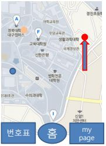
  -  지도에 식당이 표시되며, 이를 클릭할 수 있다.
- 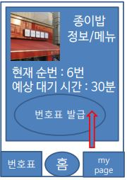 
  - 클릭이 되면, 해당 식당의 정보가 나오며 현재 대기 순번과 예상 대기 시간을 알 수 있다.
- 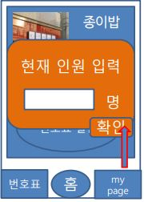 
  - 번호표 발급을 누를시, 현재 인원 입력 창이 뜨며 현재 인원을 입력하고 확인을 누르면 예약이 완료된다.
- 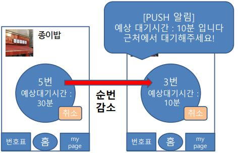 
  - 사람들이 빠질 수록 순번이 감소하며 예상 대기시간이 10분이 남았을때는 Push 알람으로 알려준다.
- 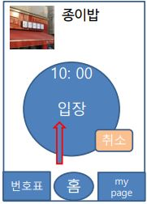
  - 자신의 차례가 되면 10분 타이머가 흐르며 10분 이내로 도착해서 입장 버튼을 누르지 않을경우 예약이 자동 취소가 된다.
---

## Use Case Diagram

- 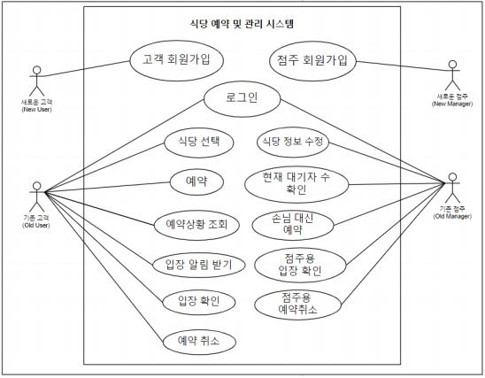
  - 

---

## Class Diagram

- 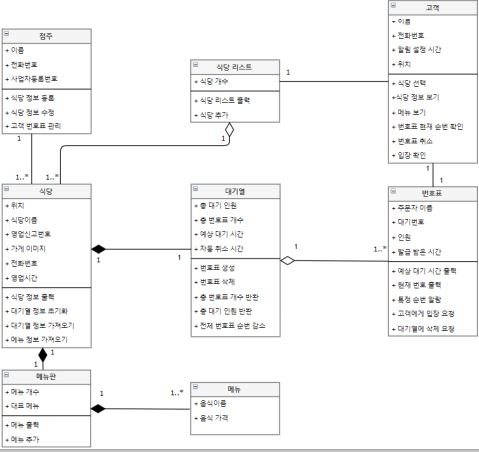
- 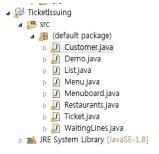
 
---

## Sequence Diagram

- 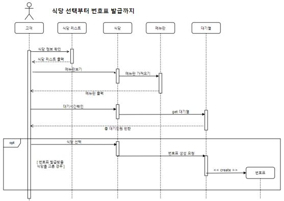
- 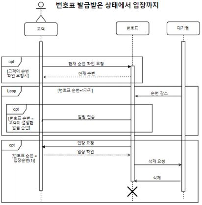

---

## State Diagram

- 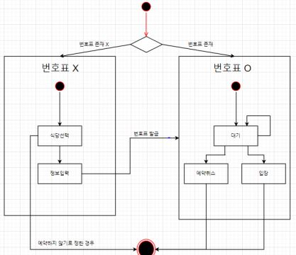

---

## Code

- 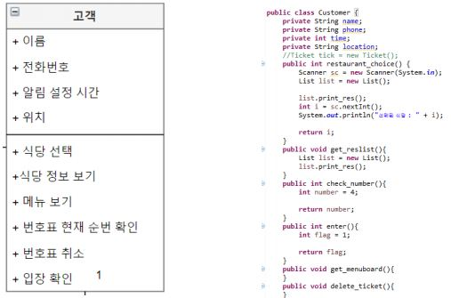
- 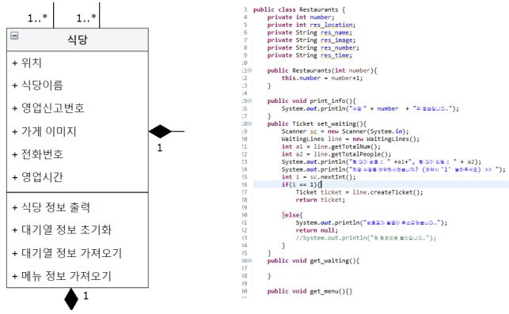

---

## Testing

- 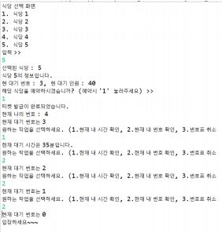

---

## Team Name & Member
- 조명 : 이판사판(2조)
- 팀장 : 이효동
- 서기 : 구보미
- 팀원 : 권영인, 김기현, 박준호